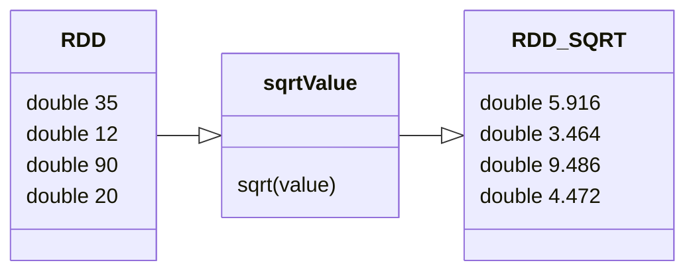

# Mapping Operations

### Operation
When RDD is created, the values are immutable. As such,
a new RDD_SQRT is created in holding the mapped values


### Syntax
```
JavaRDD<Double> sqrtRDD = myRDD.map( 
    value -> Math.sqrt(value) 
);
```

### Outputting the result
The common way is to write the data into a file.
It could write it to a file system like HDFS, and be distributed
across multiple nodes in a cluster.
For testing purposes, we just just a foreach method.
```
sqrtRDD.foreach(
    value -> System.out.println( value )
);
```

### Map and reduce
In getting count for the RDD, instead of using count() function.
We could use the map and reduce pattern.
1. We make a new RDD and map each element as 1.
```
JavaRDD<Long> singleSqrtRDD = sqrtRdd.map( value -> 1L );
```
2. then reduce using function = value1 + value 2.
```
singleSqrtRDD.reduce( (value1, value2) -> value1 + value2 );
```

