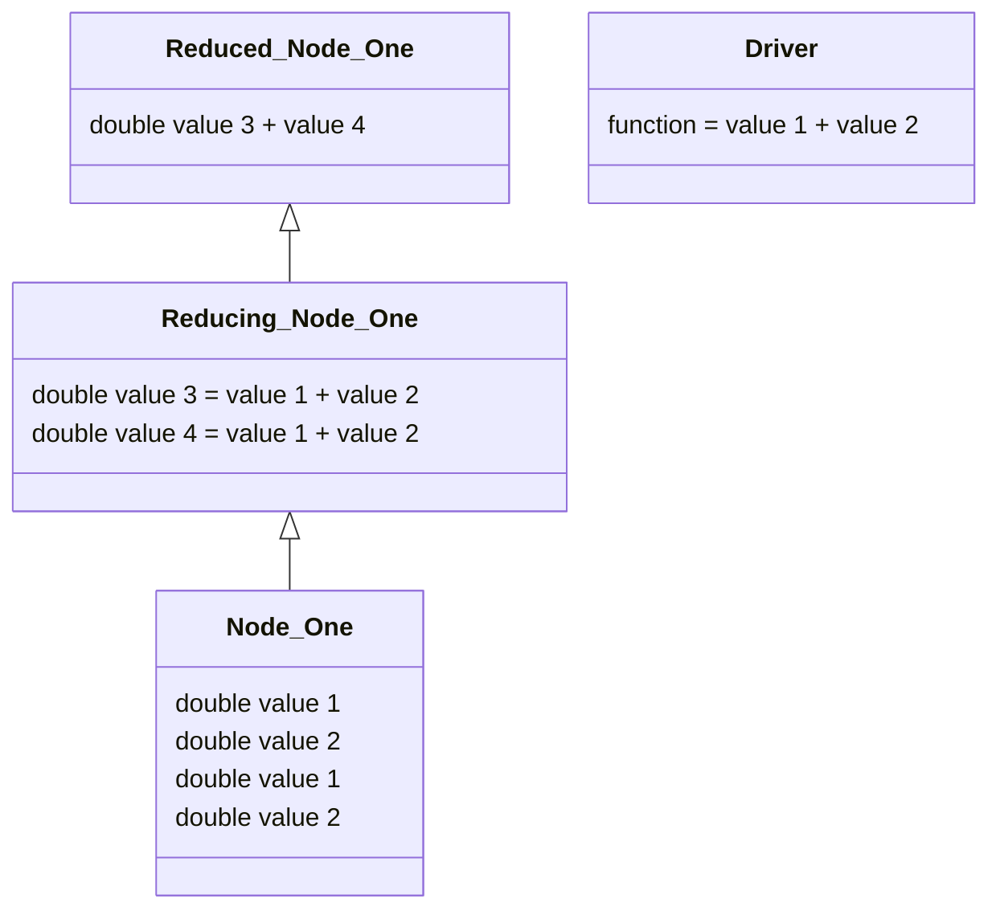
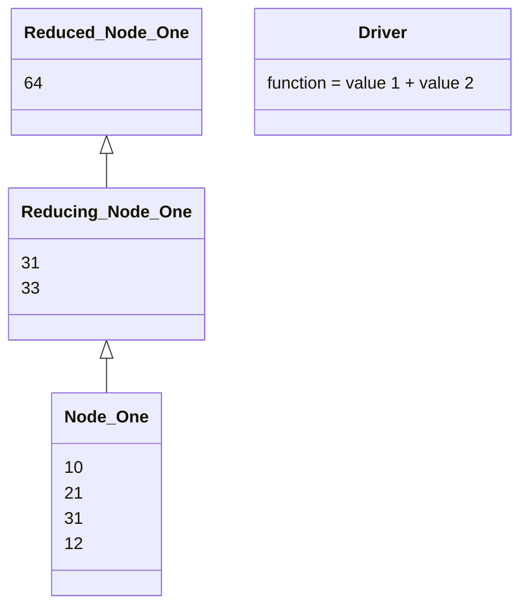

# RDD - Reduces

### RDD Reduces

```mermaid
classDiagram
    Reducing_Node_One <|-- Node_One
    Reduced_Node_One <|-- Reducing_Node_One
    class Driver {
        function = value 1 + value 2
    }
    class Node_One {
        double value 1
        double value 2
        double value 1
        double value 2
    }
    class Reducing_Node_One {
        double value 3 = value 1 + value 2
        double value 4 = value 1 + value 2
    }
    class Reduced_Node_One {
        double value 3 + value 4
    }
```

### Example

```mermaid
classDiagram
    Reducing_Node_One <|-- Node_One
    Reduced_Node_One <|-- Reducing_Node_One
    class Driver {
        function = value 1 + value 2
    }
    class Node_One {
        10
        21
        31
        12
    }
    class Reducing_Node_One {
        31
        33
    }
    class Reduced_Node_One {
        64
    }
```
### Syntax of RDD reduces
By using Java 8 lambda expression in reduce function.
```
myRDD.reduce(
    (value1, value2) -> value1 + value2
)
```